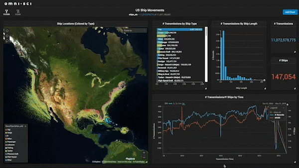

<h1 align="center"> DATA  ANALYST 💫 АНАЛИТИК ДАННЫХ </h1>

## Здравствуйте, меня зовут Александр! Добро пожаловать в мой профиль на GitHub! 

Сейчас изучаю новый инструмент - машинное обучение. Основные навыки: - Excel (Power Query, Power pivot) - SQL (оконные функции, процедуры, джобы ) - Python (Pandas, numpy, seaborn, matplotlib, sklearn, подключение к БД, работа с API, парсинг) - Статистика (Описательная статистика, проверка гипотез, бутстрап) - Tableau - Знание продуктовых и маркетинговых метрик (LTV,ARPU,ROMI,CPA, CTR и тд), моделей атрибуций - Основы машинного обучения (Лин регрессия, Логистическая регрессия, деревья решений, Кластеризация) 

## 🌐 Socials:

# 💻 Tech Stack:
             
# 📊 GitHub Stats:
 
 

---

<!-- Proudly created with GPRM ( https://gprm.itsvg.in ) -->
